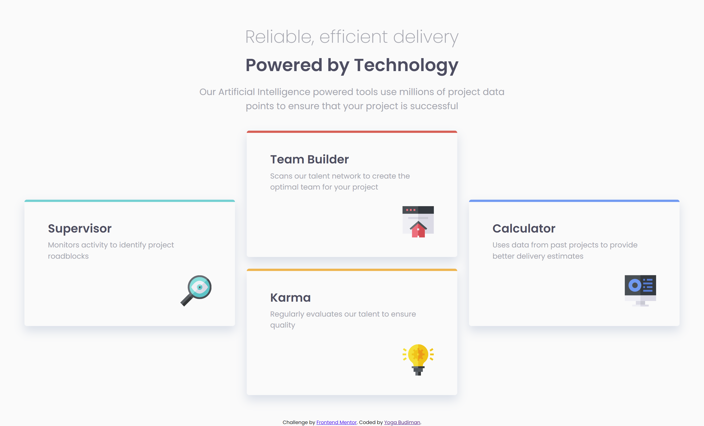

# Frontend Mentor - Four card feature section solution

This is a solution to the [Four card feature section challenge on Frontend Mentor](https://www.frontendmentor.io/challenges/four-card-feature-section-weK1eFYK). Frontend Mentor challenges help you improve your coding skills by building realistic projects.

## Table of contents

- [Overview](#overview)
  - [The challenge](#the-challenge)
  - [Screenshot](#screenshot)
  - [Links](#links)
- [My process](#my-process)
  - [Built with](#built-with)
  - [Continued development](#continued-development)
  - [Useful resources](#useful-resources)
- [Author](#author)

## Overview

### The challenge

Users should be able to:

- View the optimal layout for the site depending on their device's screen size

### Screenshot

### Links

- Solution URL: (https://github.com/ygabdn29/four-card-feature)
- Live Site URL: (https://ygabdn29.github.io/four-card-feature/)

## My process

### Built with

- HTML5
- CSS custom properties
- Flexbox
- CSS Grid
- Mobile-first workflow

### Continued development

- Adding more breakpoint
- Shadow could be better

### Useful resources

- [MDN](https://developer.mozilla.org/en-US/)
- [CSSTricks-Grid](https://css-tricks.com/snippets/css/complete-guide-grid/)
- [CSSTricks-Flex](https://css-tricks.com/snippets/css/a-guide-to-flexbox/)

## Author

- Yoga Budiman
